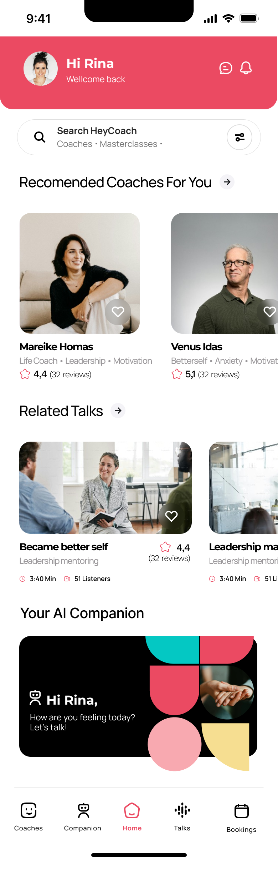
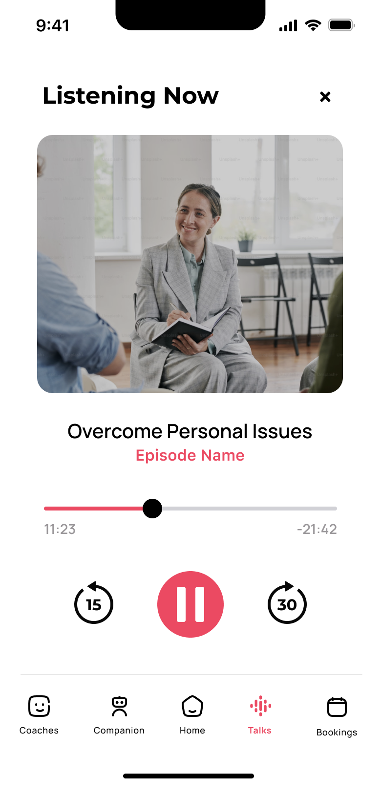
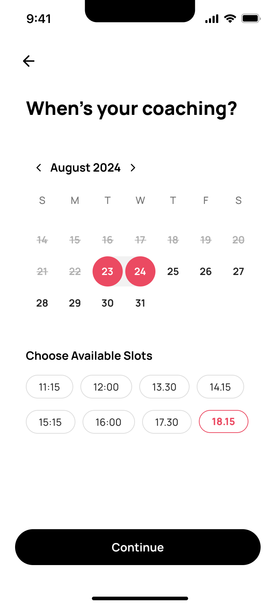
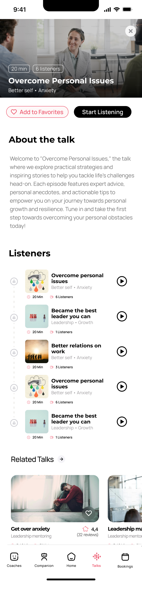

# HeyCoach

Welcome to HeyCoach, a Flutter project designed to connect coaches and coachees in an interactive and engaging platform. This app is built using FlutterFlow and is intended to run on the Flutter _stable_ release.

## Getting Started

To get started with HeyCoach, ensure you have Flutter installed on your system. For detailed instructions, visit the [Flutter official documentation](https://flutter.dev/docs/get-started/install).

## Features

- **Interactive Dashboard**: Access all features from a single, intuitive dashboard.
- **Real-Time Chat**: Engage in real-time discussions and coaching sessions.
- **Appointment Scheduling**: Easily schedule and manage appointments.

## Screenshots

Here are some screenshots of the app in action:


*Dashboard view*


*Real-time chat interface*


*Appointment scheduling interface*


*Detailed view of chat sessions*

## Installation

1. Clone the repository:
   ```bash
   git clone [repository-url]
   ```
2. Navigate to the project directory:
   ```bash
   cd HeyCoach
   ```
3. Install dependencies:
   ```bash
   flutter pub get
   ```
4. Run the app:
   ```bash
   flutter run
   ```

## Contributing

Contributions are welcome! Please feel free to submit a pull request or open an issue if you have suggestions or improvements.

## License

This project is licensed under the MIT License - see the [LICENSE](LICENSE) file for details.
